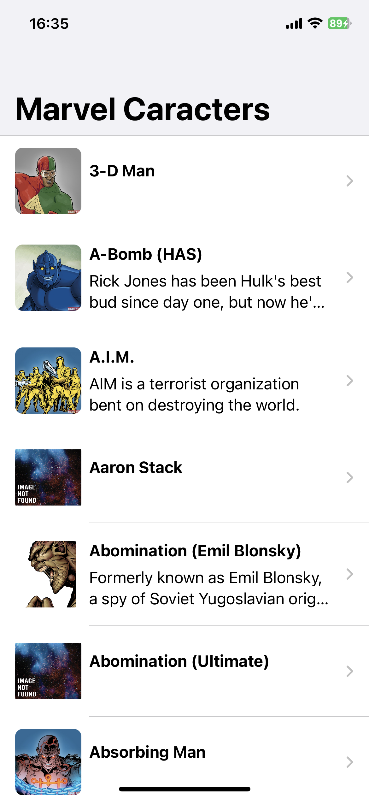
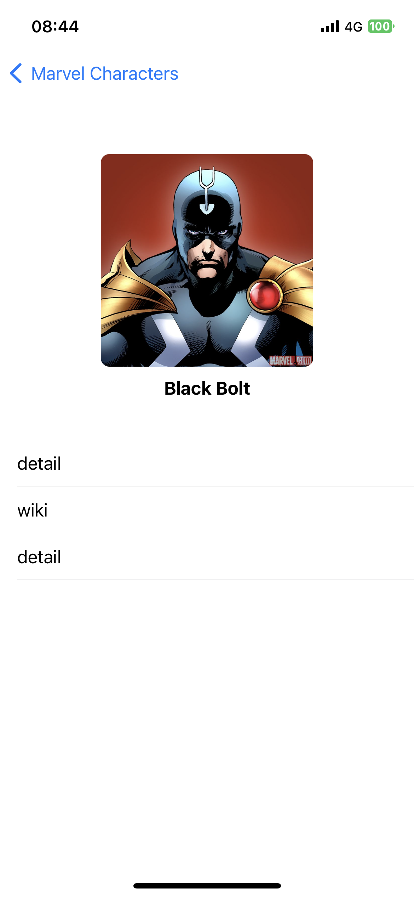

## Marvel Characters

[logo 來源](https://www.crushingkrisis.com/crushing-comics/marvel-logo-square-300/)

>練習SwiftUI + Combine
### 特色
* SwiftUI + Combine
* [Marvel API](https://developer.marvel.com/)
* MVVM

## 預覽
* 角色列表   
* 角色   

### 感謝
* [SwiftUI List with Custom Cell & Passing Data](https://www.youtube.com/watch?v=k5rupivxnMA)
* [#104 利用 Marvel API 開發漫威的 iOS App](https://medium.com/%E5%BD%BC%E5%BE%97%E6%BD%98%E7%9A%84%E8%A9%A6%E7%85%89-%E5%8B%87%E8%80%85%E7%9A%84-100-%E9%81%93-swift-ios-app-%E8%AC%8E%E9%A1%8C/104-%E5%88%A9%E7%94%A8-marvel-api-%E9%96%8B%E7%99%BC%E6%BC%AB%E5%A8%81%E7%9A%84-ios-app-952c67213458)

